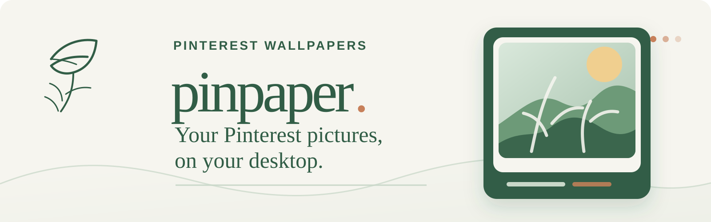
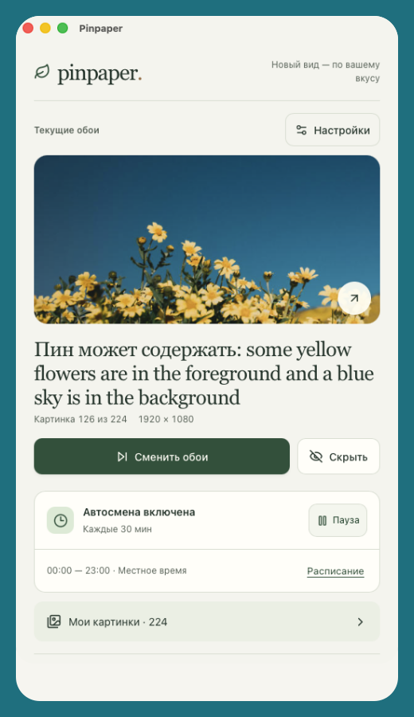
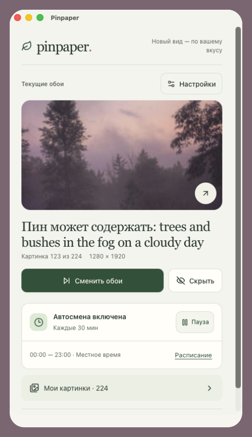
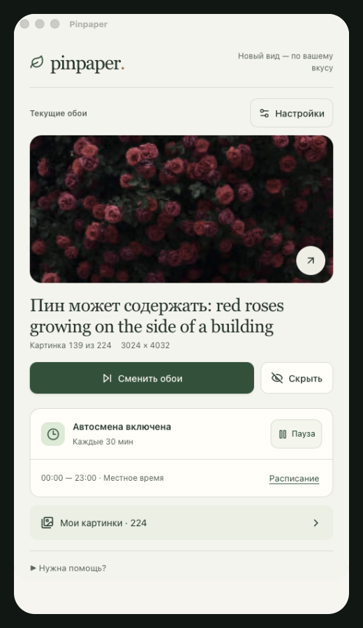
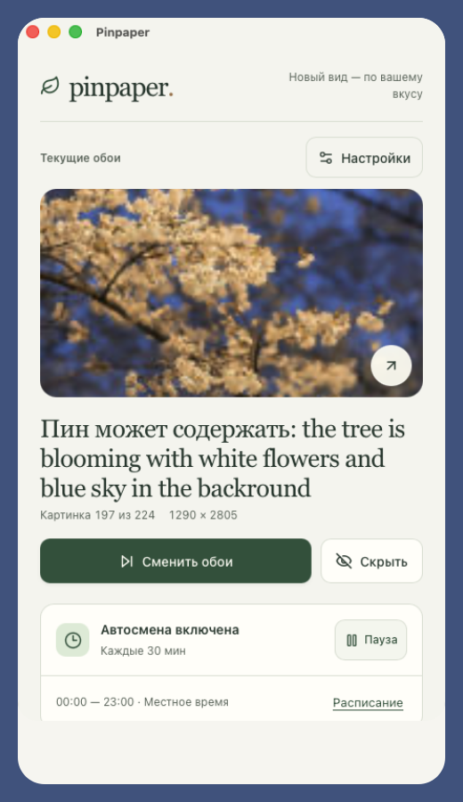

<div align="center">



<p>
  <a href="#english">English</a>
  ·
  <a href="#russian">Русский</a>
</p>

</div>

<a id="english"></a>

## English

Pinpaper turns pictures from Pinterest into desktop wallpapers. Change them with one click or let the app change them automatically.

Available for macOS, Windows, and Linux. Your collection is saved on your computer.

### What Pinpaper does

- Add pictures from your Pinterest feed or a board.
- Choose which collections and image sizes to use.
- Set how often your wallpaper changes.
- Hide pictures you don't want to see.

### Screenshots

<table align="center">
  <tr>
    <td valign="top"></td>
    <td valign="top"></td>
  </tr>
  <tr>
    <td valign="top"></td>
    <td valign="top"></td>
  </tr>
</table>

<p align="center"><sub>A compact view of your current wallpaper, schedule, and collection.</sub></p>

### Install

[Pinpaper 0.1.0 is available](https://github.com/sydney-0o/pinpaper/releases/tag/v0.1.0). Download the file for your computer:

| System | File | What to do |
| --- | --- | --- |
| macOS 11+, Apple Silicon | [DMG · arm64](https://github.com/sydney-0o/pinpaper/releases/download/v0.1.0/Pinpaper_0.1.0_macOS_arm64.dmg) | Open the file and drag Pinpaper to Applications. |
| macOS 11+, Intel | [DMG · x64](https://github.com/sydney-0o/pinpaper/releases/download/v0.1.0/Pinpaper_0.1.0_macOS_x64.dmg) | Open the file and drag Pinpaper to Applications. |
| Windows 10/11, x64 | [Portable EXE](https://github.com/sydney-0o/pinpaper/releases/download/v0.1.0/Pinpaper_0.1.0_x64-portable.exe) | Keep it in any folder and double-click it. |
| Linux, x64 | [AppImage](https://github.com/sydney-0o/pinpaper/releases/download/v0.1.0/Pinpaper_0.1.0_linux_x64.AppImage) | Allow it to run in the file's Properties, then open it. |
| Debian / Ubuntu, x64 | [DEB](https://github.com/sydney-0o/pinpaper/releases/download/v0.1.0/Pinpaper_0.1.0_linux_x64.deb) | Double-click the file and choose Install. |

<details>
<summary>macOS details</summary>

Choose **Apple menu → About This Mac** to check your processor. For an M1 or newer chip, download the `arm64` file. For an Intel processor, download `x64`.

The app is not yet signed by Apple. macOS may show a warning when you first open it. Check that you downloaded it from this repository's Releases page, then use macOS's **Open** option if offered.

</details>

<details>
<summary>Windows details</summary>

No installer is needed. Keep the `.exe` in a folder where you want to use it.

If the app asks for WebView2, install the [Microsoft Edge WebView2 Runtime](https://developer.microsoft.com/microsoft-edge/webview2/) and try again.

An unsigned build may also trigger SmartScreen. Before choosing **More info → Run anyway**, check that the file came from this repository's Releases page.

</details>

<details>
<summary>Linux details</summary>

For an AppImage, enable **Allow executing file as program** in the file properties and open it. The equivalent terminal commands are:

```sh
chmod +x Pinpaper_*_linux_x64.AppImage
./Pinpaper_*_linux_x64.AppImage
```

Use the `.deb` package on Debian or Ubuntu. AppImage is convenient when you want a movable copy without an installation step.

Linux downloads are for x64 computers and are built on Ubuntu 24.04.

Changing wallpapers works on GNOME, Unity, Budgie, Cinnamon, and MATE. KDE, Xfce, and wlroots-only desktops are not supported yet.

</details>

### First launch

1. In Pinpaper, open **Settings → Open Pinterest**.
2. Sign in to Pinterest in the window that opens.
3. Open your feed or a saved board. Scroll to load the pictures you want.
4. Return to Pinpaper and click **Add pictures**.
5. Choose your collections, save the settings, and click **Change wallpaper**.

Want more pictures? Scroll further in Pinterest and click **Add pictures** again. Each import adds up to 200 pictures. Videos are skipped.

### Automatic wallpaper changes

In **Automatic changes**, choose how often to change the wallpaper and during which hours. Then turn automatic changes on.

Pinpaper keeps working when you close its window. To stop it, click its icon near the system clock and choose **Quit Pinpaper**.

#### Start with your computer

In Settings, turn on **Launch Pinpaper when I sign in** and save. Turn it off the same way.

Keep a portable copy in a permanent folder before enabling this option.

<details>
<summary>How pictures are picked</summary>

Pinpaper goes through the pictures that match your settings before starting again. It skips pictures that cannot be downloaded or are too small.

Changing filters updates which pictures can be used. Your collection and progress are saved, so you do not need to add everything again after restarting or updating the app.

</details>

### Privacy and Pinterest

Pinpaper is an independent project that respects Pinterest. It is not an official Pinterest app and **does not use the Pinterest API**.

- You choose the Pinterest page to import from.
- Pinpaper does not read your password. The Pinterest window does not keep your login after you close it.
- Your collection and settings stay on your computer. Hiding a picture in Pinpaper does not remove it from Pinterest.

<details>
<summary>Where the pictures come from</summary>

Pinpaper downloads the pictures you import. If a pin links to a source website, the app may use the matching image from that site. Otherwise, it uses the Pinterest copy.

Pinterest may ask you to verify your sign-in or change how its pages work. If pictures are missing, load more in Pinterest and try importing again.

</details>

Images belong to their authors and owners. Pinterest is a trademark of Pinterest, Inc.

### License

Pinpaper is free software licensed under [GNU GPLv3](LICENSE).

Found a problem or have an idea? [Tell us here](https://github.com/sydney-0o/pinpaper/issues).

<details>
<summary>Build from source and release workflow</summary>

Pinpaper is a Tauri 2 desktop application with a React/TypeScript interface and a Rust core. Local development needs Node.js 22+, stable Rust, and the native dependencies for the target OS.

```sh
npm ci
npm run tauri -- dev
```

Useful local checks are:

```sh
npm test
npm run build
cargo test --locked --manifest-path src-tauri/Cargo.toml
```

Build packages on the target operating system:

```sh
# macOS
npm run tauri -- build --bundles dmg

# Linux
npm run tauri -- build --bundles appimage,deb

# Windows portable executable
npm run tauri -- build --no-bundle
```

Windows builds use WebView2 and Visual Studio C++ Build Tools. Linux builds need WebKitGTK 4.1, GTK, AppIndicator, `libxdo`, OpenSSL, and the usual build tools. GitHub Actions builds on the target operating system and publishes tagged releases.

| System | Release file |
| --- | --- |
| macOS | `Pinpaper_<version>_macOS_arm64.dmg` or `Pinpaper_<version>_macOS_x64.dmg` |
| Windows | `Pinpaper_<version>_x64-portable.exe` |
| Linux | `Pinpaper_<version>_linux_x64.AppImage` and `Pinpaper_<version>_linux_x64.deb` |

</details>

<hr>

<a id="russian"></a>

## Русский

Pinpaper ставит картинки из Pinterest на обои рабочего стола. Меняйте их одной кнопкой или включите автоматическую смену.

Работает на macOS, Windows и Linux. Коллекция сохраняется на вашем компьютере.

### Что умеет Pinpaper

- Добавлять картинки из ленты или доски Pinterest.
- Выбирать коллекции и размер изображений для обоев.
- Менять обои через заданные промежутки времени.
- Скрывать картинки, которые вам не нравятся.

[Посмотреть скриншоты ↑](#screenshots)

### Установка

[Pinpaper 0.1.0 уже доступен](https://github.com/sydney-0o/pinpaper/releases/tag/v0.1.0). Скачайте файл для своего компьютера:

| Система | Файл | Что делать |
| --- | --- | --- |
| macOS 11+, Apple Silicon | [DMG · arm64](https://github.com/sydney-0o/pinpaper/releases/download/v0.1.0/Pinpaper_0.1.0_macOS_arm64.dmg) | Открыть файл и перетащить Pinpaper в «Программы». |
| macOS 11+, Intel | [DMG · x64](https://github.com/sydney-0o/pinpaper/releases/download/v0.1.0/Pinpaper_0.1.0_macOS_x64.dmg) | Открыть файл и перетащить Pinpaper в «Программы». |
| Windows 10/11, x64 | [Portable EXE](https://github.com/sydney-0o/pinpaper/releases/download/v0.1.0/Pinpaper_0.1.0_x64-portable.exe) | Сохранить в удобную папку и запустить двойным щелчком. |
| Linux, x64 | [AppImage](https://github.com/sydney-0o/pinpaper/releases/download/v0.1.0/Pinpaper_0.1.0_linux_x64.AppImage) | Разрешить запуск в свойствах файла, затем открыть его. |
| Debian / Ubuntu, x64 | [DEB](https://github.com/sydney-0o/pinpaper/releases/download/v0.1.0/Pinpaper_0.1.0_linux_x64.deb) | Открыть файл двойным щелчком и нажать «Установить». |

<details>
<summary>Подробности для macOS</summary>

Посмотрите процессор в меню **Apple → Об этом Mac**. Для M1 и новее скачайте файл `arm64`, для Intel — `x64`.

У приложения пока нет подписи Apple, поэтому при первом запуске macOS может показать предупреждение. Убедитесь, что файл скачан со страницы Releases этого репозитория. Если macOS предлагает действие **Открыть**, воспользуйтесь им.

</details>

<details>
<summary>Подробности для Windows</summary>

Установщик не нужен: сохраните `.exe` в удобную папку и запускайте его оттуда.

Если приложение попросит WebView2, установите [Microsoft Edge WebView2 Runtime](https://developer.microsoft.com/microsoft-edge/webview2/) и попробуйте снова.

Неподписанный файл может вызвать предупреждение SmartScreen. Перед запуском проверьте, что файл скачан со страницы Releases этого репозитория.

</details>

<details>
<summary>Подробности для Linux</summary>

Для AppImage откройте свойства файла и разрешите запуск как программы. Затем откройте файл. Через терминал:

```sh
chmod +x Pinpaper_*_linux_x64.AppImage
./Pinpaper_*_linux_x64.AppImage
```

DEB подходит для Debian и Ubuntu. AppImage удобнее, если нужна переносимая копия без установки.

Файлы для Linux рассчитаны на компьютеры x64 и собраны на Ubuntu 24.04.

Смена обоев работает в GNOME, Unity, Budgie, Cinnamon и MATE. KDE, Xfce и окружения только с wlroots пока не поддерживаются.

</details>

### Первый запуск

1. В Pinpaper откройте **Настройки → Открыть Pinterest**.
2. Войдите в Pinterest в появившемся окне.
3. Откройте ленту или сохранённую доску. Прокрутите страницу, чтобы загрузить нужные картинки.
4. Вернитесь в Pinpaper и нажмите **Добавить картинки**.
5. Выберите коллекции, сохраните настройки и нажмите **Сменить обои**.

Хотите добавить ещё? Прокрутите Pinterest дальше и снова нажмите **Добавить картинки**. За один раз добавляется до 200 картинок. Видео пропускаются.

### Автоматическая смена обоев

В разделе **Автоматическая смена** выберите, как часто менять обои и в какие часы. Затем включите её.

Pinpaper продолжает работать после закрытия окна. Чтобы остановить приложение, нажмите на его значок рядом с системными часами и выберите **Выйти из Pinpaper**.

#### Запуск вместе с компьютером

В настройках включите **Запускать Pinpaper при входе в систему** и сохраните изменения. Отключить можно там же.

Если используете переносимую версию, сначала положите её в постоянную папку.

<details>
<summary>Как выбираются картинки</summary>

Pinpaper перебирает картинки, которые подходят под ваши настройки, прежде чем начать заново. Слишком маленькие изображения и картинки, которые не удалось скачать, пропускаются.

После изменения фильтров меняется и список подходящих картинок. Коллекция и прогресс сохраняются: после перезапуска или обновления добавлять всё заново не нужно.

</details>

### Приватность и Pinterest

Pinpaper — независимый проект, созданный с уважением к Pinterest. Это не официальное приложение Pinterest. Оно **не использует Pinterest API**.

- Вы сами выбираете страницу Pinterest, откуда добавить картинки.
- Pinpaper не читает ваш пароль. Окно Pinterest не сохраняет вход после закрытия.
- Коллекция и настройки хранятся на вашем компьютере. Скрытая в Pinpaper картинка остаётся в Pinterest.

<details>
<summary>Откуда берутся изображения</summary>

Pinpaper скачивает добавленные вами картинки. Если у пина есть ссылка на сайт-источник, приложение может взять оттуда то же изображение. В остальных случаях используется копия из Pinterest.

Pinterest может попросить подтвердить вход или изменить работу своих страниц. Если картинок не хватает, загрузите больше в Pinterest и повторите добавление.

</details>

Права на изображения остаются у их авторов и владельцев. Pinterest — товарный знак Pinterest, Inc.

### Лицензия

Pinpaper — свободное программное обеспечение под лицензией [GNU GPLv3](LICENSE).

Нашли ошибку или хотите что-то предложить? [Напишите здесь](https://github.com/sydney-0o/pinpaper/issues).

<details>
<summary>Сборка из исходников и выпуск релизов</summary>

Pinpaper — приложение Tauri 2 с интерфейсом на React/TypeScript и ядром на Rust. Для локальной разработки понадобятся Node.js 22+, stable Rust и системные зависимости целевой ОС.

```sh
npm ci
npm run tauri -- dev
```

Локальные проверки:

```sh
npm test
npm run build
cargo test --locked --manifest-path src-tauri/Cargo.toml
```

Сборка пакетов выполняется на соответствующей системе:

```sh
# macOS
npm run tauri -- build --bundles dmg

# Linux
npm run tauri -- build --bundles appimage,deb

# Windows portable executable
npm run tauri -- build --no-bundle
```

Сборка Windows использует WebView2 и Visual Studio C++ Build Tools. Для Linux нужны WebKitGTK 4.1, GTK, AppIndicator, `libxdo`, OpenSSL и обычные инструменты сборки. GitHub Actions собирает приложение на целевой системе и публикует tagged-релизы.

| Система | Файл релиза |
| --- | --- |
| macOS | `Pinpaper_<version>_macOS_arm64.dmg` или `Pinpaper_<version>_macOS_x64.dmg` |
| Windows | `Pinpaper_<version>_x64-portable.exe` |
| Linux | `Pinpaper_<version>_linux_x64.AppImage` и `Pinpaper_<version>_linux_x64.deb` |

</details>
