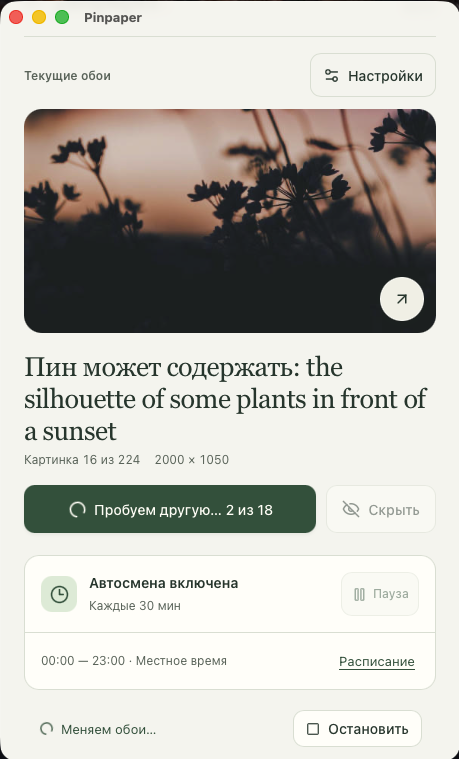
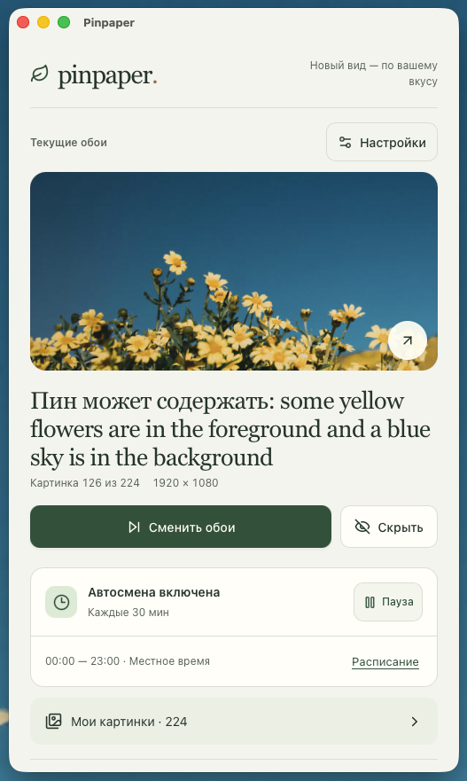
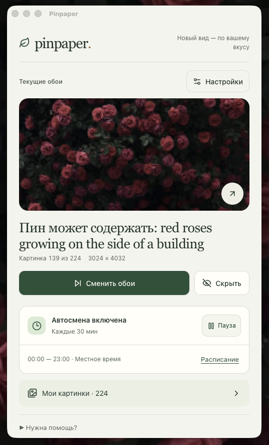

# Pinpaper

<div align="center">


**Your saved inspiration, turned into a calm desktop rotation.**

Pinpaper is a small, local-first desktop app for changing your wallpaper from pictures you choose on Pinterest. Pick a board or your home feed, set a schedule, and let the app bring a little variety to your desktop without keeping a browser tab open.

[Download the latest release](../../releases) · [Report a problem](../../issues)

</div>

<p align="center">
  
  
  
  
</p>

## What Pinpaper does

Pinpaper keeps a local collection of pictures imported from the Pinterest page you are already viewing. It can then:

- change the wallpaper manually or on a schedule;
- filter by orientation, minimum width, words and collections;
- keep running in the menu bar or system tray when the main window is closed;
- open the original pin, hide a picture locally, and restore it later;
- start with your computer when you enable **Launch Pinpaper when I sign in** in Settings.

The app is intentionally simple: it is a desktop companion for your own saved inspiration, not a Pinterest client or a replacement for Pinterest.

## Download and install

Use the file for your operating system from [Releases](../../releases). Release files are produced by GitHub Actions from this repository.

### macOS — DMG

1. Download the file ending in `.dmg`.
2. Open it and drag **Pinpaper** to **Applications**.
3. Open Pinpaper from Applications. If macOS shows a first-run warning for an unsigned build, control-click the app, choose **Open**, and confirm.

Pinpaper supports macOS 11 and newer. Signed and notarized distribution can be added by a maintainer with an Apple Developer certificate; the public workflow currently builds an unsigned DMG.

### Windows — portable EXE

1. Download the file ending in `_x64-portable.exe`.
2. Put it in any folder where you want to keep it.
3. Double-click it. There is no installer and no system-wide installation step.

Windows 10 and 11 normally include the WebView2 runtime. If Windows reports that WebView2 is missing, install the current **Microsoft Edge WebView2 Runtime** once and start Pinpaper again.

The public build is not code-signed, so SmartScreen may show a warning on first launch. Check that the file came from this repository's Releases page before choosing **More info → Run anyway**.

### Linux — AppImage or DEB

**AppImage (portable):** download the file ending in `.AppImage`, make it executable in the file manager's Properties dialog, then double-click it. You can keep it in any folder. From a terminal, the equivalent is:

```sh
chmod +x Pinpaper_*_linux.AppImage
./Pinpaper_*_linux.AppImage
```

**Debian/Ubuntu:** download the `.deb` file and open it with the system software installer. The AppImage is the better choice when you want a self-contained, movable copy.

The implemented desktop integrations are GNOME, Unity, Budgie, Cinnamon and MATE. KDE, Xfce and wlroots-only desktops are not supported by the wallpaper adapter yet. On a minimal Linux installation, the desktop may also need its WebKitGTK and AppIndicator runtime packages.

## First launch

1. Open **Settings** and choose **Open Pinterest**.
2. Sign in in the private Pinterest window that Pinpaper opens. Pinpaper does not ask you to paste a password into the app.
3. Open Home, your profile, or **Saved → a board**. Scroll until the pictures you want have loaded.
4. Return to Pinpaper and choose **Add pictures**. Repeat after scrolling to import another group.
5. Select the collections to use, choose **Save settings**, and press **Change wallpaper**.

The default rotation prefers landscape pictures at least 1,280 pixels wide. You can change that in Settings. Set an interval and active hours under **Automatic changes**, then enable **Change my wallpaper automatically**. To launch Pinpaper when you sign in, enable **Launch Pinpaper when I sign in** in the separate startup section and save the settings.

Closing the main window leaves Pinpaper working in the menu bar or system tray. Choose **Quit Pinpaper** from the tray menu to stop it completely. The startup checkbox can be turned off in Settings at any time; it removes the matching macOS LaunchAgent, Windows per-user startup entry, or Linux autostart `.desktop` file.

## Privacy, Pinterest and source images

Pinpaper respects Pinterest and is not affiliated with, sponsored by or endorsed by Pinterest. Pinterest is a trademark of Pinterest, Inc.

This project does **not** use or exploit the Pinterest API. It does not require a developer account, app secret, OAuth setup or Pinterest API credentials. Import is deliberately tied to the Pinterest page and private window that you open yourself. Password fields are never read, and the private window's session is not stored after it is closed.

Imported metadata, preferences and the local image cache stay on your computer. Opening a pin or hiding/restoring a picture does not change anything on Pinterest. Pinpaper may use a public outbound source recorded on a pin when it can verify that it is the same picture; it never invents a source URL or sends your Pinterest account cookie to that site. Images that cannot be verified safely remain on the observed Pinterest copy.

Pinterest pages can change, require verification, or expose only a limited group of loaded pins. Videos are skipped, an import captures up to 200 image pins at a time, and the local collection keeps up to 1,000 pins. Repeat the import after loading another group when needed.

## Release files and automatic startup

Every tagged release is built on its target operating system by [`.github/workflows/release.yml`](.github/workflows/release.yml):

| Platform | Release file                          | What it is                            |
| -------- | ------------------------------------- | ------------------------------------- |
| macOS    | `Pinpaper_<version>_macOS.dmg`        | Drag-to-Applications disk image       |
| Windows  | `Pinpaper_<version>_x64-portable.exe` | Portable x64 executable; no installer |
| Linux    | `Pinpaper_<version>_linux.AppImage`   | Portable desktop bundle               |
| Linux    | `Pinpaper_<version>_linux.deb`        | Debian/Ubuntu package                 |

The **Launch Pinpaper when I sign in** option is implemented locally for all three platforms:

- macOS writes a per-user `~/Library/LaunchAgents/app.pinpaper.desktop.plist`;
- Windows writes a per-user `HKCU\Software\Microsoft\Windows\CurrentVersion\Run` value;
- Linux writes `~/.config/autostart/app.pinpaper.desktop`.

It is opt-in, requires no administrator password, and is removed when the checkbox is cleared or local data is reset.

## Build from source

This is a Tauri 2 desktop application with a React/TypeScript interface and a Rust core. For development, install:

- Node.js 22 or newer;
- stable Rust;
- macOS: Xcode Command Line Tools;
- Windows: Visual Studio C++ Build Tools, Windows SDK and WebView2;
- Linux: WebKitGTK 4.1, GTK, AppIndicator, `libxdo`, OpenSSL and the usual build tools.

Then run:

```sh
npm ci
npm run tauri -- dev
```

Useful local checks are:

```sh
npm test
npm run build
cargo test --locked --manifest-path src-tauri/Cargo.toml
```

To build a bundle locally, build on the target OS so the native desktop adapter and bundle format match the machine:

```sh
# macOS
npm run tauri -- build --bundles dmg

# Linux
npm run tauri -- build --bundles appimage,deb

# Windows portable executable
npm run tauri -- build --no-bundle
```

The Windows executable is at `src-tauri/target/release/pinpaper.exe`. The macOS and Linux bundles are under `src-tauri/target/release/bundle/`. Signing, notarization and Windows code signing are intentionally separate from the public workflow.

## License

Pinpaper is distributed under the [GNU General Public License v3.0](LICENSE). See the complete canonical license text in [`LICENSE`](LICENSE).
